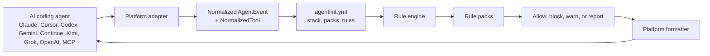
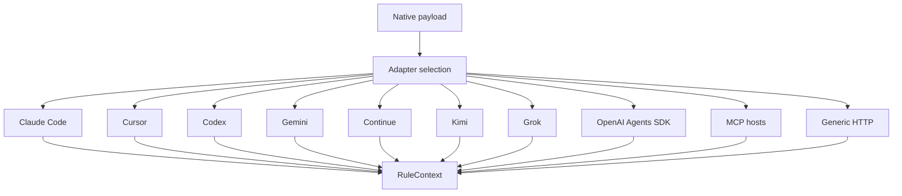
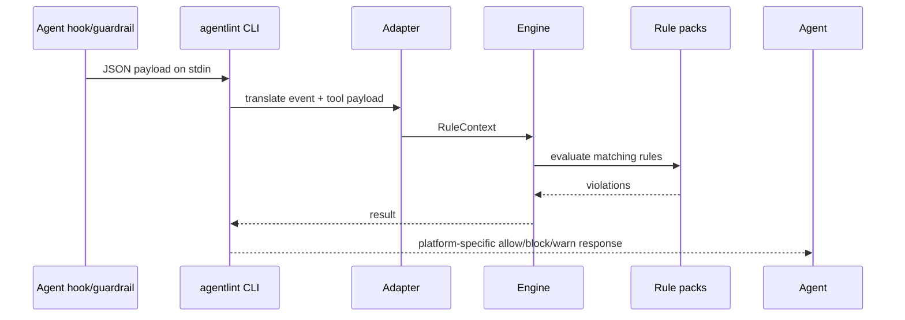
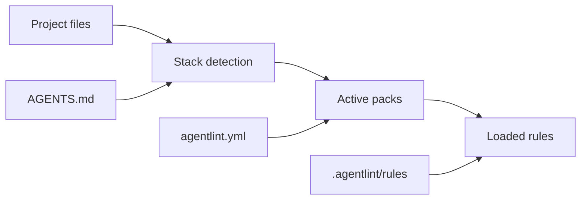
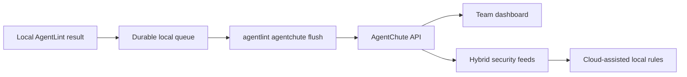
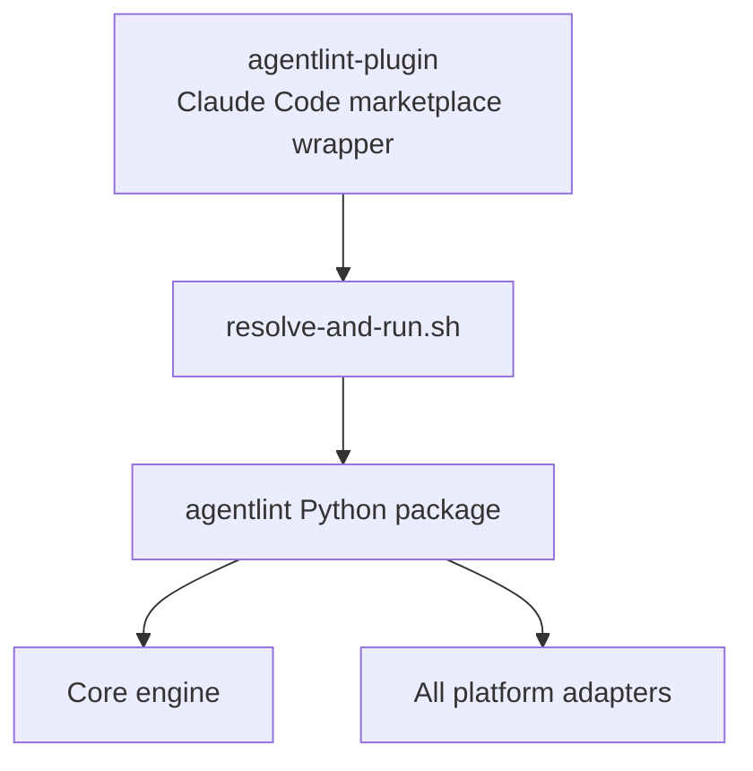

# AgentLint Architecture

AgentLint is a local-first guardrail engine for AI coding agents. The core package is agent-agnostic: adapters translate each tool's hook or guardrail payload into one normalized event shape, then the same rule engine evaluates it.

## System Map

## Adapter Layer

Adapters own platform-specific details:

- Native event names.
- Tool-name mapping.
- Hook installation and uninstall.
- Output formatting expected by the agent.
- Project directory resolution.

Rules should not know which AI tool invoked them.

## Rule Evaluation

ERROR rules can block an action. WARNING rules advise the agent. INFO rules show in reports. The circuit breaker can degrade noisy rules over a session, but security-critical rules remain blocking.

## Configuration Flow

`stack: auto` activates packs from project files. Explicit `packs:` entries override auto-detection. Rule-level configuration lives under `rules:`.

## AgentChute Opt-In

AgentChute is disabled unless a license key and opt-in are present. The queue sends privacy-safe event summaries only: rule IDs, severity, timestamps, tool name, session metadata, and sanitized summaries. It does not send raw file contents, full prompts, or full edit strings.

## Plugin Repo Relationship

The plugin repo is not the core product. It is the Claude Code marketplace packaging layer. All rules, adapters, AgentChute sync, and CLI behavior live in the `agentlint` Python package.

## Release Boundary

For a release, test these surfaces separately:

- Core rule engine and adapter tests: `uv run pytest`.
- Package metadata and install behavior.
- Claude Code plugin metadata and binary resolver.
- Local AgentLint-to-AgentChute integration smoke from the AgentChute repo.
