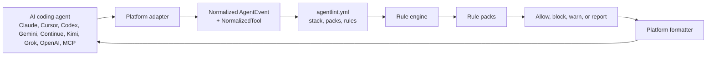
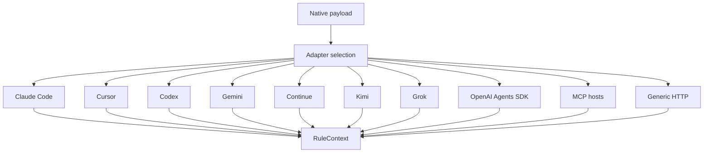
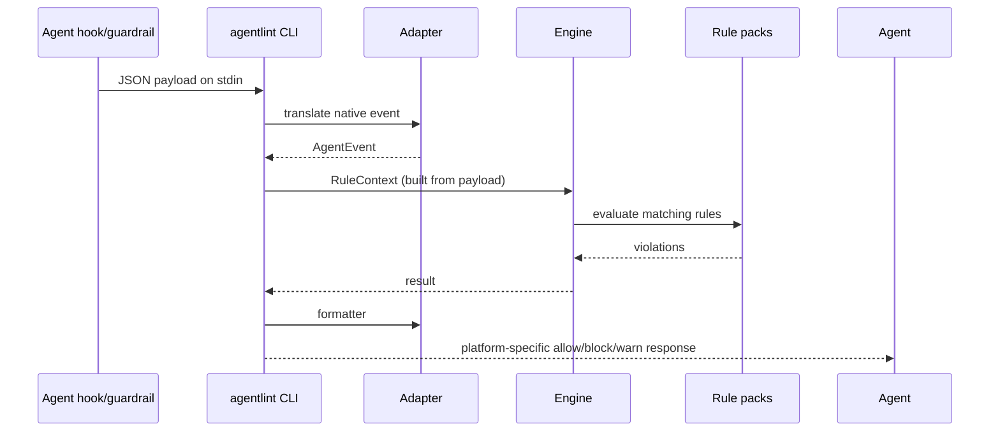
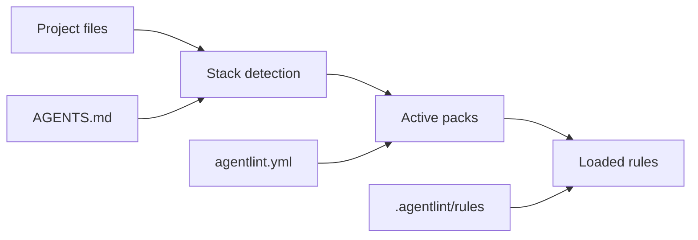
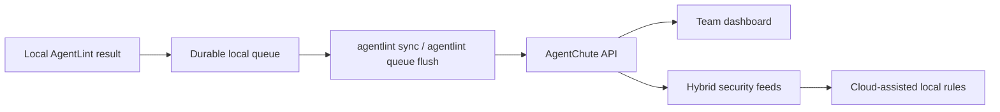
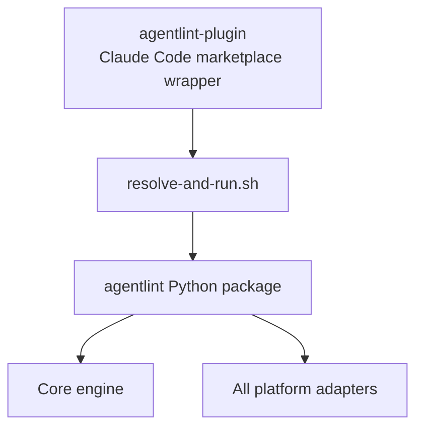

# AgentLint Architecture

AgentLint is a local-first guardrail engine for AI coding agents. The core package is agent-agnostic: adapters translate each tool's hook or guardrail payload into one normalized event shape, then the same rule engine evaluates it.

## System Map

```mermaid
flowchart LR
  Agent[AI coding agent<br/>Claude, Cursor, Codex, Gemini, Continue, Kimi, Grok, OpenAI, MCP] --> Adapter[Platform adapter]
  Adapter --> Event[Normalized AgentEvent<br/>+ NormalizedTool]
  Event --> Config[agentlint.yml<br/>stack, packs, rules]
  Config --> Engine[Rule engine]
  Engine --> Rules[Rule packs]
  Rules --> Result[Allow, block, warn, or report]
  Result --> Formatter[Platform formatter]
  Formatter --> Agent
```

## Adapter Layer

```mermaid
flowchart TB
  Raw[Native payload] --> Detect[Adapter selection]
  Detect --> Claude[Claude Code]
  Detect --> Cursor[Cursor]
  Detect --> Codex[Codex]
  Detect --> Gemini[Gemini]
  Detect --> Continue[Continue]
  Detect --> Kimi[Kimi]
  Detect --> Grok[Grok]
  Detect --> OpenAI[OpenAI Agents SDK]
  Detect --> MCP[MCP hosts]
  Detect --> Generic[Generic HTTP]
  Claude --> Normalized[RuleContext]
  Cursor --> Normalized
  Codex --> Normalized
  Gemini --> Normalized
  Continue --> Normalized
  Kimi --> Normalized
  Grok --> Normalized
  OpenAI --> Normalized
  MCP --> Normalized
  Generic --> Normalized
```

Adapters own platform-specific details:

- Native event names.
- Tool-name mapping.
- Hook installation and uninstall.
- Output formatting expected by the agent.
- Project directory resolution.

Rules should not know which AI tool invoked them. To add an agent, see
[custom-adapters.md](custom-adapters.md).

## Components

| Module (`src/agentlint/`) | Role |
|---------------------------|------|
| `cli.py` | Click commands. `check` is the hook entry point: it reads the payload, builds the `RuleContext`, runs the engine and prints the adapter's response. |
| `adapters/` | One adapter per agent (`base.py` defines `AgentAdapter`). |
| `formats/` | Output formatters for each hook protocol. |
| `core/models.py` | `Rule`, `RuleContext`, `Violation`, `Severity`, `HookEvent`, `AgentEvent`, `NormalizedTool`. |
| `engine.py` | Selects active rules, applies required rules, exemptions, approvals and severity, and evaluates. |
| `config.py`, `detector.py` | Load `agentlint.yml` and workspace policy; detect packs from project files. |
| `packs/` | Built-in rule packs, plus loaders for custom and installed rules. |
| `utils/shell.py` | Shell parsing. `split_operations()` splits simple commands joined by `&&`, `\|\|`, `;`, `\|`, `&` or newlines into operations classified as display, read-only or state-changing. Built-in operation guards see only state-changing operations; anything not fully modelled keeps raw-text checks. |
| `circuit_breaker.py` | Degrades repeatedly firing rules within a session, except protected ones. |
| `approvals.py` | Typed, expiring, human-issued approvals for one action class in one repository. Agents cannot create them. |
| `evidence.py` | Evidence receipts (test runs, reviews, verified deploys). Advisory only; they never unblock an ERROR. |
| `coverage.py` | Per-agent hook coverage for `status` and `doctor`: reads hook files at project and user scope, and a heartbeat that `check` writes on every call (no content stored). |
| `session.py`, `recorder.py`, `reporter.py` | Session state, opt-in local recordings, and the Stop report. |
| `diagnostics.py` | Sanitized diagnostic bundles (`check --diagnostic-bundle`) and Codex output validation. |
| `mcp_server.py` | MCP server exposing rule checks as tools. |
| `agentchute/` | Optional AgentChute client: queue, sync, cached policy. |

See [approvals-and-evidence.md](approvals-and-evidence.md),
[diagnostics.md](diagnostics.md) and [mcp.md](mcp.md) for the user-facing side.

## Rule Evaluation

```mermaid
sequenceDiagram
  participant Hook as Agent hook/guardrail
  participant CLI as agentlint CLI
  participant Adapter as Adapter
  participant Engine as Engine
  participant Pack as Rule packs
  participant Agent as Agent

  Hook->>CLI: JSON payload on stdin
  CLI->>Adapter: translate native event
  Adapter-->>CLI: AgentEvent
  CLI->>Engine: RuleContext (built from payload)
  Engine->>Pack: evaluate matching rules
  Pack-->>Engine: violations
  Engine-->>CLI: result
  CLI->>Adapter: formatter
  CLI-->>Agent: platform-specific allow/block/warn response
```

ERROR rules can block an action on `PreToolUse`. WARNING rules advise the agent. INFO rules show in reports. The circuit breaker can degrade noisy rules over a session; `no-secrets`, `no-env-commit`, required workspace rules and locked organization rules are never degraded.

For shell commands, the engine first parses the command into operations with `utils/shell.py`. Built-in operation guards evaluate the state-changing operations (and `no-destructive-commands`, `no-force-push` and `no-push-to-main` evaluate each operation separately). Credential, file-write, custom and organization rules always see the original command.

## Configuration Flow

```mermaid
flowchart LR
  Project[Project files] --> Detect[Stack detection]
  Detect --> Packs[Active packs]
  Config[agentlint.yml] --> Packs
  AGENTS[AGENTS.md] --> Detect
  Packs --> Rules[Loaded rules]
  Custom[.agentlint/rules] --> Rules
```

`stack: auto` activates packs from project files. Explicit `packs:` entries override auto-detection. `universal` and `quality` are always active unless listed in `exclude_packs`. Rule-level configuration lives under `rules:`. See [configuration.md](configuration.md) and [custom-rules.md](custom-rules.md).

## AgentChute Opt-In

```mermaid
flowchart LR
  Engine[Local AgentLint result] --> Queue[Durable local queue]
  Queue --> Flush[agentlint sync / agentlint queue flush]
  Flush --> API[AgentChute API]
  API --> Dashboard[Team dashboard]
  API --> Feeds[Hybrid security feeds]
  Feeds --> Rules[Cloud-assisted local rules]
```

AgentChute is disabled unless a license key and opt-in are present. The queue sends privacy-safe event summaries only: rule IDs, severity, timestamps, tool name, session metadata, and sanitized summaries. It does not send raw file contents, full prompts, or full edit strings.

Inspect and send the queue with `agentlint queue status`, `agentlint queue inspect` and `agentlint queue flush` (or `agentlint sync`). Inspect the cached workspace policy with `agentlint policy status`, `agentlint policy explain` and `agentlint policy refresh`. See [agentchute.md](agentchute.md) and [cli.md](cli.md).

## Plugin Repo Relationship

```mermaid
flowchart TB
  Plugin[agentlint-plugin<br/>Claude Code marketplace wrapper] --> Resolver[resolve-and-run.sh]
  Resolver --> Package[agentlint Python package]
  Package --> Engine[Core engine]
  Package --> Adapters[All platform adapters]
```

The plugin repo is not the core product. It is the Claude Code marketplace packaging layer. All rules, adapters, AgentChute sync, and CLI behavior live in the `agentlint` Python package.

## Release Boundary

For a release, test these surfaces separately:

- Core rule engine and adapter tests: `uv run pytest -q`.
- Package metadata and install behavior (build and install the wheel).
- Claude Code plugin metadata and binary resolver (`agentlint-plugin` CI).
- AgentLint-to-AgentChute integration: `agentlint test` runs a local and AgentChute end-to-end smoke test.

The full maintainer checklist is in [RELEASE.md](../RELEASE.md).
